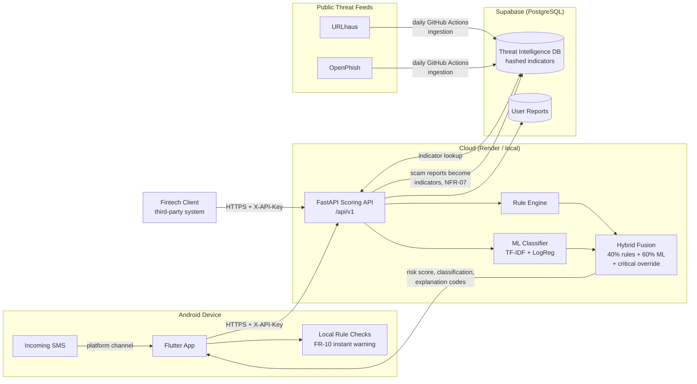
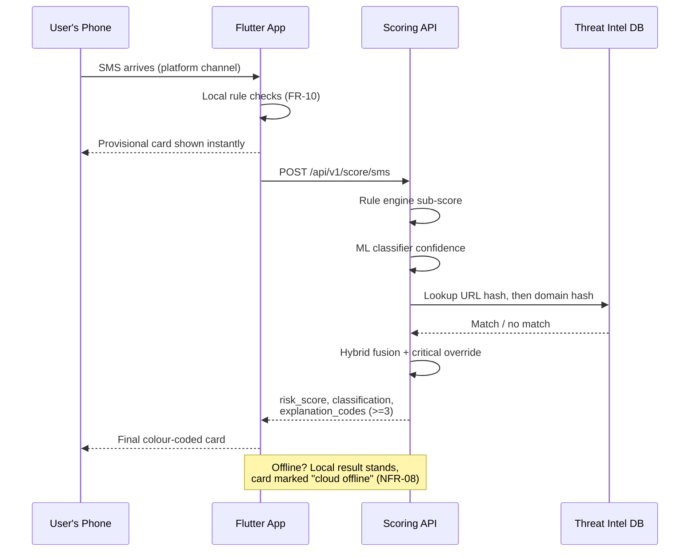
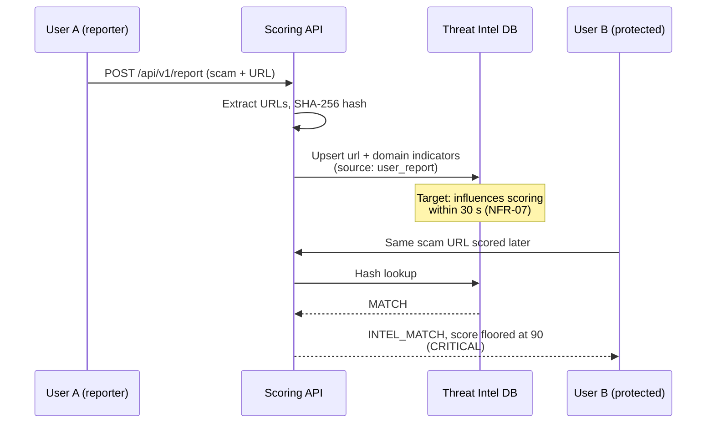
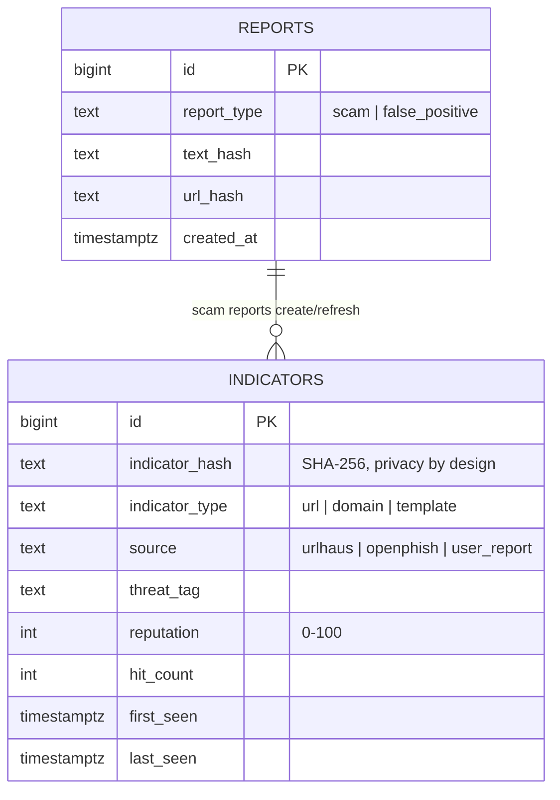
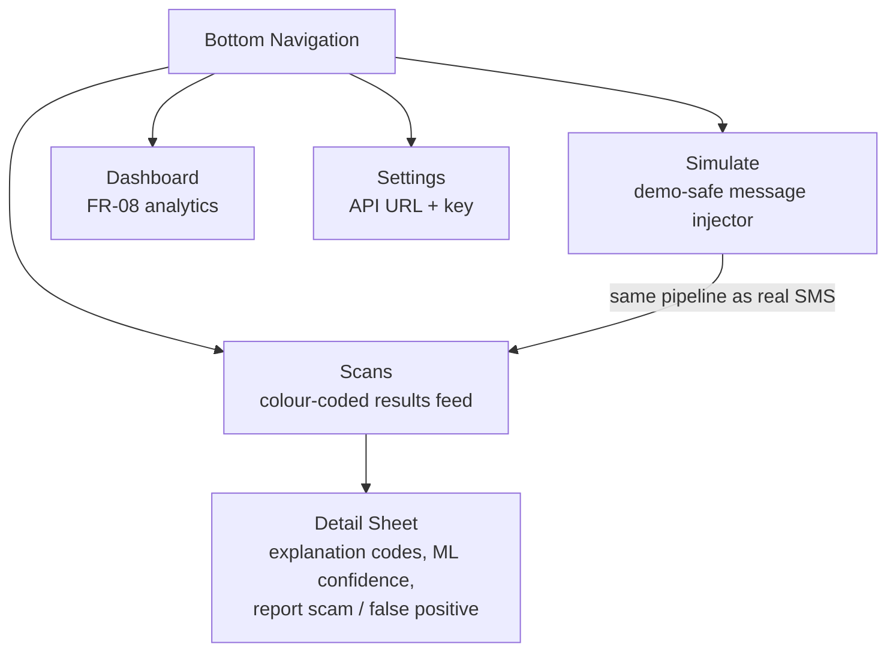

# ScamShield — System Architecture

Visual documentation of the integrated system. All diagrams are Mermaid and
render directly on GitHub.

## 1. System overview

## 2. Scoring flow (one message, end to end)

## 3. Intelligence propagation (user report protects everyone)

## 4. Database schema

## 5. Mobile app structure

## 6. Repository map

| Folder | Role | Key entry point |
|---|---|---|
| `ml/` | Detection engine + training | `train.py`, `score.py` |
| `api/` | Cloud scoring service | `main.py` |
| `ingestion/` | DB schema + feed pipeline | `schema.sql`, `ingest.py` |
| `mobile-app/` | Flutter app source | `lib/main.dart`, `setup.sh` |
| `fintech-client/` | Interoperability demo | `client.py` |
| `perf/` | §14.6 measurement scripts | `latency_test.py`, `propagation_test.py` |
| `.github/workflows/` | CI, daily ingestion, keep-alive | `ci.yml`, `ingest.yml` |
